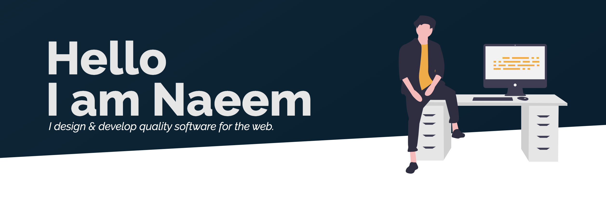

# Hi there , I'm Naeem

I am a **Software Engineer** and a **Front-End Web Developer**

 

Connect with me on 

   &ensp;
   &ensp;
   &ensp;
   &ensp;

 

## Tech Stack

I work with many different technologies and languages, but my favorites are **JavaScript**, **React.js**, **Next.js**, **Node.js**, and **Express.js**.
### Front-End

   &emsp;
   &emsp;
   &emsp;
   &emsp;
   &emsp;

### Back-End

   &ensp;
   &emsp;
   &ensp;
   &emsp;

### Design

   &emsp;
   &emsp;
   &emsp;

### Tools

   &emsp;

